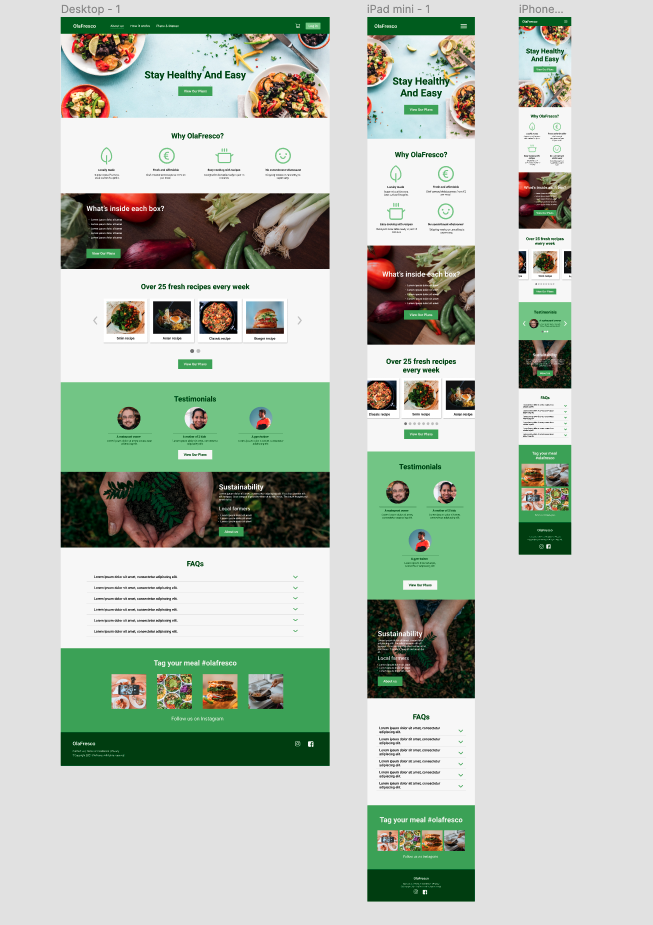
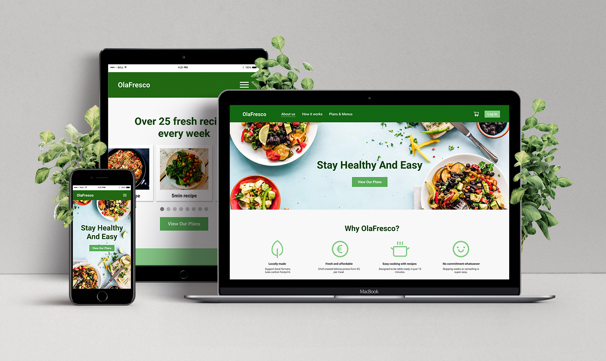

# Client Project

This exercise is about client communication and planning. You'll learn to use new design tools, plan your work to save development time (though there won't be any coding on this project), and communicate user stories through UML diagrams.

## Learning Objectives
- [x] Define the client’s needs
- [x] Scope the project
- [x] Define User functionalities (login, logout, delete, ...)
- [ ] Prepare a UML diagram (for both navigations and actions)
- [x] Prepare a wireframe of the website with for example balsamiq (Only top page)
- [x] Prepare a mockup of the website using a design tool such as Figma  (Only top page for desktop)
- [x] Communicate the endresult with the client
- [x] Add a quality readme

### Client needs (user stories)

### OlaFresco
OlaFresco needs a website for meal orders

#### Minimum client demands :

- The landing page explains the service
- A member section to choose meals
- A member section to keep track of their orders
- An admin section to manage meal deliveries
- Member profile allow to specify user allergies that automatically filter meals

This website will look a lot like [hellofresh](https://hellofresh.com/)

#### Mind mapping
[https://atlas.mindmup.com/2021/08/415b6a40ff6211eb8342f760a4bc616a/olafresco_website_landing_page/index.html](https://atlas.mindmup.com/2021/08/415b6a40ff6211eb8342f760a4bc616a/olafresco_website_landing_page/index.html)
* the link will work only for 6 months from the published date

#### Landing page mockup
[https://www.figma.com/file/wk8esGpvP94ICku5OFuBPn/Client-project?node-id=0%3A1](https://www.figma.com/file/wk8esGpvP94ICku5OFuBPn/Client-project?node-id=0%3A1)

